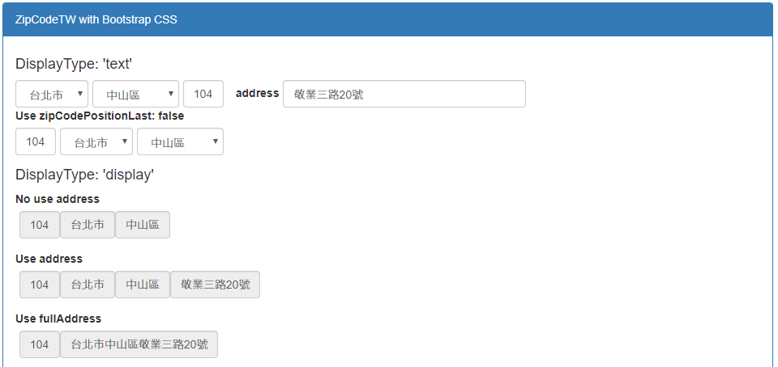

# zipcode-tw-react

提供台灣縣市、行政區下拉選單以及郵遞區號輸入欄位組合的React Component  
藉由RawData快速進行郵遞區號切換，並提供地址合併顯示。

[Github](https://github.com/Chris-Tsai/zipcode-tw-react)

## Demo
Tyr it online: https://chris-tsai.github.io/

